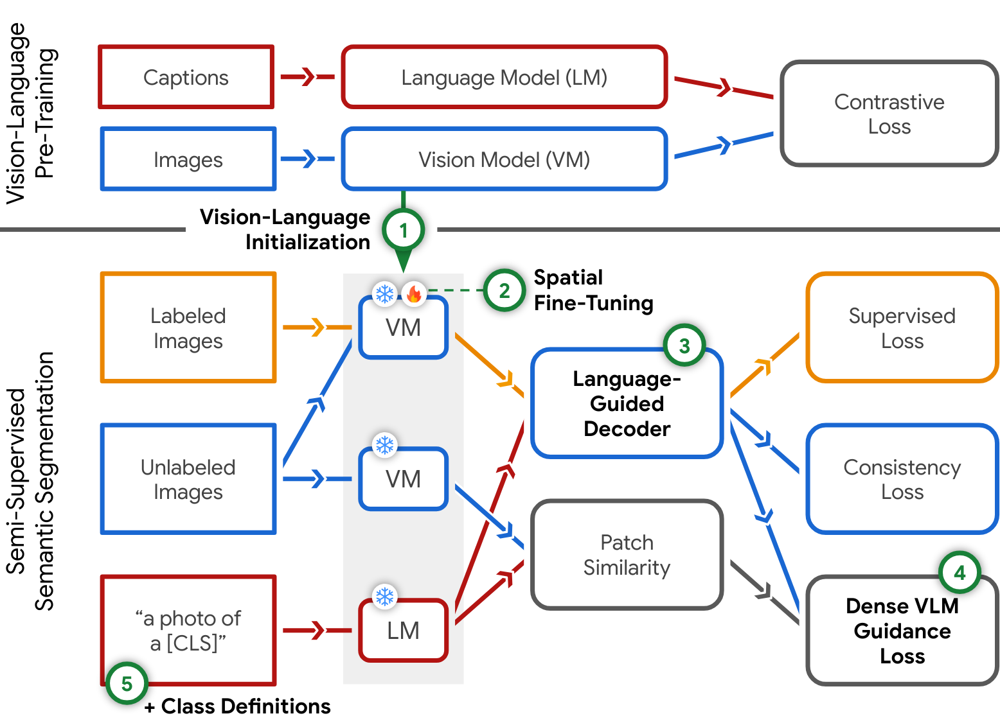
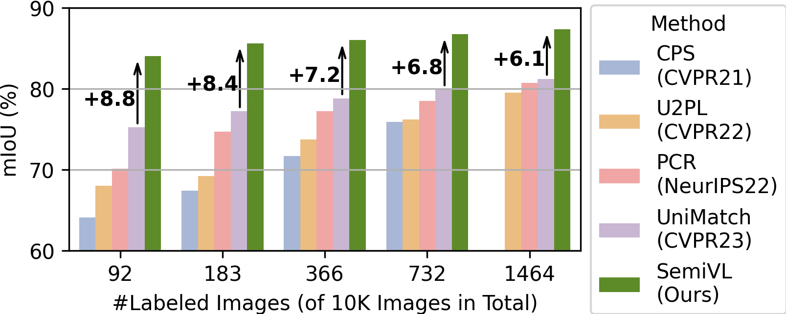
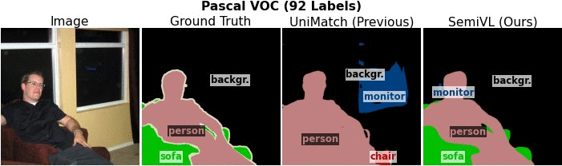

# SemiVL: Semi-Supervised Semantic Segmentation with Vision-LanguageGuidance

**by
[Lukas Hoyer](https://lhoyer.github.io/),
[David Joseph Tan](https://scholar.google.de/citations?user=iEwvGPkAAAAJ&hl=en),
[Muhammad Ferjad Naeem](https://ferjad.github.io/),
[Luc Van Gool](https://scholar.google.de/citations?user=TwMib_QAAAAJ&hl=en),
and [Federico Tombari](https://federicotombari.github.io/)**

TODO: Arxiv Link

*This is not an officially supported Google product.*

## Overview

In semi-supervised semantic segmentation, a model is trained with a limited number of labeled images along with a large corpus of unlabeled images to reduce the high annotation effort. While previous methods are able to learn good segmentation boundaries, they are prone to confuse classes with similar visual appearance due to the limited supervision. On the other hand, vision-language models (VLMs) are able to learn diverse semantic knowledge from image-caption datasets but produce noisy segmentation due to the image-level training. In SemiVL, we propose to integrate rich priors from VLM pre-training into semi-supervised semantic segmentation to learn better semantic decision boundaries. To adapt the VLM from global to local reasoning, we introduce a spatial fine-tuning strategy for label-efficient learning. Further, we design a language-guided decoder to jointly reason over vision and language. Finally, we propose to handle inherent ambiguities in class labels by providing the model with language guidance in the form of class definitions.



We evaluate SemiVL on 4 semantic segmentation datasets (Pascal VOC, COCO, ADE20K, and Cityscapes), where it achieves major gains over previous semi-supervised methods as shown exemplary for Pascal VOC below.



The improvements are also qualitatively reflected in the example predictions, where SemiVL better distinguishes classes with similar visual appearance. Please note that SemiVL was trained in these examples with only 92 labeled images on Pascal VOC and with only 158 labeled images on ADE20K.



If you find SemiVL useful in your research, please consider citing:

```
@article{hoyer2023semivl,
  title={{SemiVL}: Semi-Supervised Semantic Segmentation withVision-Language Guidance},
  author={Hoyer, Lukas and Tan, David Joseph and Naeem, Muhammad Ferjad and Van Gool, Luc and Tombari, Federico},
  journal={arXiv preprint arXiv:TODO},
  year={2023}
}
```

## Getting Started

### Environment

Create a conda environment:

```bash
conda create -n semivl python=3.7.13
conda activate semivl
```

Install the required pip packages:

```bash
pip install -r requirements.txt
```

### Pre-Trained Backbones

Download and convert the CLIP ViT-B/16 weights:

```bash
mkdir -p pretrained/
python third_party/maskclip/convert_clip_weights.py --model ViT16 --backbone
cp ~/.cache/clip/ViT-B-16.pt pretrained/
```

If you want to also want to run the UniMatch ResNet101 baseline, please follow [UniMatch#pretrained-backbone](https://github.com/LiheYoung/UniMatch#pretrained-backbone).

### Datasets

Please, download the following datasets:

- Pascal VOC12: [JPEGImages](http://host.robots.ox.ac.uk/pascal/VOC/voc2012/VOCtrainval_11-May-2012.tar) | [SegmentationClass](https://drive.google.com/file/d/1ikrDlsai5QSf2GiSUR3f8PZUzyTubcuF/view?usp=sharing)
- Cityscapes: [leftImg8bit](https://www.cityscapes-dataset.com/file-handling/?packageID=3) | [gtFine](https://drive.google.com/file/d/1E_27g9tuHm6baBqcA7jct_jqcGA89QPm/view?usp=sharing)
- COCO: [train2017](http://images.cocodataset.org/zips/train2017.zip) | [val2017](http://images.cocodataset.org/zips/val2017.zip) | [masks](https://drive.google.com/file/d/166xLerzEEIbU7Mt1UGut-3-VN41FMUb1/view?usp=sharing)
- ADE20K: [ADEChallengeData2016](http://data.csail.mit.edu/places/ADEchallenge/ADEChallengeData2016.zip)

Please, extract the datasets to the following folder structure:

```
$HOME/data/
├── voc
    ├── JPEGImages
    └── SegmentationClass
├── cityscapes
    ├── leftImg8bit
    └── gtFine
├── coco
    ├── train2017
    ├── val2017
    └── masks
├── ADEChallengeData2016
    ├── images
    └── annotations
```

Note: The ground truth of VOC12, Cityscapes, and COCO have been preprocessed by [UniMatch](https://github.com/LiheYoung/UniMatch).

## Training

To launch a training job, please run:

```bash
python experiments.py --exp EXP_ID --run RUN_ID
# e.g. EXP_ID=40; RUN_ID=0 for SemiVL on VOC with 92 labels
```

It will automatically generate the relevant config files in `configs/generated/` and start the corresponding training job.

For more information on the available experiments and runs, please refer to `def generate_experiment_cfgs(exp_id)` in [experiments.py](experiments.py).

The training log, tensorboard, checkpoints, and debug images are stored in `exp/`.

## Checkpoints

We provide SemiVL's checkpoints, logs, tensorboards, and predictions in the following [GitHub Release](TODO).

## Evaluation

A checkpoint can be evaluated with:

```bash
python -m third_party.unimatch.eval \
    --config CONFIG_PATH \
    --save-path CHECKPOINT_PATH \
    --pred-path PREDICTION_OUTPUT_PATH
```

the corresponding prediction will be saved to `PREDICTION_OUTPUT_PATH` and the evaluation metrics will be printed in the terminal.

## Framework Structure

The following list provides the most relevant files of SemiVL's implementation:

* [experiments.py](experiments.py): Definitions of the experiment configs used in the paper.
* [semivl.py](semivl.py): Main training logic for SemiVL.
* [model/vlm.py](model/vlm.py): Vision-language model class.
* [model/decode_heads/vlg_head.py](model/decode_heads/vlg_head.py): Language-guided decoder.
* [model/text_embeddings.py](model/text_embeddings.py): Definition of the text embeddings including the concept aggregation logic.
* [model/builder.py](model/builder.py): Logic for building a model from a config including a forward wrapper for feature perturbations.
* [third_party/maskclip/models/backbones/maskclip_vit.py](third_party/maskclip/models/backbones/maskclip_vit.py): ViT encoder for dense vision embeddings.
* [third_party/unimatch/dataset/semi.py](third_party/unimatch/dataset/semi.py): Data loader for semi-supervised training.
* [configs/\_base\_/models](configs/_base_/models): Model config files.

## Acknowledgements

SemiVL is based on [UniMatch](https://github.com/LiheYoung/UniMatch), [MaskCLIP](https://github.com/chongzhou96/MaskCLIP), [ZegCLIP](https://github.com/ZiqinZhou66/ZegCLIP), and [MMSegmentation](https://github.com/open-mmlab/mmsegmentation). We thank their authors for making the source code publicly available.
